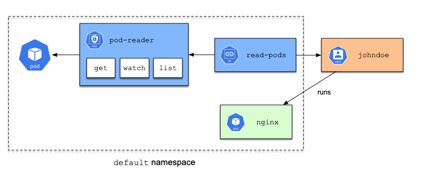

# Exercise 4

<b>Quick Reference</b>

* Namespace: `default` 
* Documentation: [Using RBAC Authorization](https://kubernetes.io/docs/reference/access-authn-authz/rbac/)

In this exercise, you will define Role Based Access Control (RBAC) to grant permissions to a specific user. The permissions should only apply to certain API resources and operations.

The following image shows the high-level architecture.

> [!NOTE]
> If you do not already have a cluster, you can create one by using minikube or you can use the O'Reilly interactive lab ["Setting up RBAC for a user"](https://learning.oreilly.com/scenarios/cka-prep-setting/9781492095477/).

## Creating the User

Run the script [create-user-context.sh](./create-user-context.sh). It will achieve the following:

1. Create a private key.
2. Create and approve a CertificateSigningRequest.
3. Add a context entry named `johndoe` to the kubeconfig file to represent the user.

For detailed information, see the [Kubernetes documentation](https://kubernetes.io/docs/reference/access-authn-authz/certificate-signing-requests/#normal-user). Assume that you do not have to memorize these instructions for the exam.

## Checking Default User Permissions

1. Change to the context to `johndoe`.
2. Create a new Pod. What would you expect to happen?

## Granting Access to the User

1. Switch back to the original context with admin permissions. In minikube, this context is called `minikube`.
2. Create a new Role named `pod-reader`. The Role should grant permissions to get, watch and list Pods.
3. Create a new RoleBinding named `read-pods`. Map the user `johndoe` to the Role named `pod-reader`.
4. Make sure that both objects have been created properly.
5. Switch to the context named `johndoe`.
6. Create a new Pod named `nginx` with the image `nginx`. What would you expect to happen?
7. List the Pods in the namespace. What would you expect to happen?
